# Diagrama de Clases: Estimador de Crecimiento Estudiantil

El diagrama usa sintaxis Mermaid `classDiagram`. Refleja la implementacion real del codigo en `src/`.

---

## Diagrama Completo

```mermaid
classDiagram

    %% ─────────────────────────────────────────
    %% TIPOS / VALUE OBJECTS (src/lib/types.ts)
    %% ─────────────────────────────────────────

    class HistoricoRow {
        +string codigoPlanEstudio
        +string planEstudio
        +string codigoGestion
        +string gestion
        +string turno
        +string grupo
        +string codigoMateria
        +string materia
        +string sigla
        +number abandono
        +number reprobados
        +number aprobados
        +number totalAlumnos
    }

    class MallaRow {
        +string carrera
        +number semestre
        +string sigla
        +string nombreAsignatura
        +string requisito
        +boolean requiereIngresoManual
    }

    class ImportResult~T~ {
        +T[] rows
        +number omitidas
        +string resumen
        +string[] errores
    }

    class ConfigCalculo {
        +string gestionActual
        +string gestionSiguiente
        +string[] gestionesAtipicas
        +MetodoProyeccion metodo
    }

    class TasaMateria {
        +string sigla
        +string carrera
        +number tasaReprobacion
        +number tasaAbandono
        +number tasaPromocion
        +EstadoTasa estado
    }

    class FilaProyeccion {
        +string carrera
        +string nombreAsignatura
        +string sigla
        +string requisito
        +string|null codigoRequisito
        +string grupo
        +number|null totalInscritosRequisito
        +number|null proyeccionReprobadosRequisito
        +number|null proyeccionAbandonosRequisito
        +number|null proyeccionAlumnosPromueven
        +number|null inscritosAsignaturaGestionAnterior
        +number|null reprobadosAsignaturaGestionAnterior
        +number|null abandonosAsignaturaGestionAnterior
        +number|null totalRepitentesGestionAnterior
        +number|null proyeccionInscritos
        +boolean editadoManualmente
        +string|null estadoEspecial
    }

    class AppState {
        +HistoricoRow[] historicoRows
        +MallaRow[] mallaRows
        +ConfigCalculo|null config
        +FilaProyeccion[] resultados
        +PasoApp paso
        +boolean cargando
        +string[] errores
    }

    %% ─────────────────────────────────────────
    %% ENUMERACIONES
    %% ─────────────────────────────────────────

    class MetodoProyeccion {
        <<enumeration>>
        promedio_simple
        regresion_lineal
    }

    class EstadoTasa {
        <<enumeration>>
        ok
        datos_insuficientes
        ingreso_manual
    }

    class PasoApp {
        <<enumeration>>
        carga
        config
        resultados
    }

    %% ─────────────────────────────────────────
    %% MODULO: IMPORTADOR (src/lib/importer.ts)
    %% ─────────────────────────────────────────

    class Importador {
        <<module>>
        +parseHistorico(buffer: Buffer) ImportResult~HistoricoRow~
        +parseMalla(buffer: Buffer) ImportResult~MallaRow~
        -HISTORICO_COLUMNS: Record~string, keyof HistoricoRow~
        -MALLA_REQUIRED_COLS: string[]
        -NON_STRUCTURED_PATTERN: RegExp
    }

    %% ─────────────────────────────────────────
    %% MODULO: PROCESADOR (src/lib/processor.ts)
    %% ─────────────────────────────────────────

    class Procesador {
        <<module>>
        +calcularTasas(historico: HistoricoRow[], config: ConfigCalculo) TasaMateria[]
        +calcularProyecciones(historico: HistoricoRow[], malla: MallaRow[], tasas: TasaMateria[], config: ConfigCalculo) FilaProyeccion[]
        -sortGestiones(gestiones: string[]) string[]
        -linearRegression(values: number[]) number
        -calcularGestionAnterior(gestion: string) string
    }

    %% ─────────────────────────────────────────
    %% MODULO: EXPORTADOR (src/lib/exporter.ts)
    %% ─────────────────────────────────────────

    class Exportador {
        <<module>>
        +generarExcel(filas: FilaProyeccion[], gestionSiguiente: string) ExcelResult
        -COLUMNS: ColumnDef[]
    }

    class ExcelResult {
        +Buffer buffer
        +string filename
    }

    %% ─────────────────────────────────────────
    %% MODULO: VALIDATORS (src/lib/validators.ts)
    %% ─────────────────────────────────────────

    class Validators {
        <<module>>
        +validarFormatoGestion(s: string) boolean
        +calcularGestionSiguiente(g: string) string
        +parsearGestionesAtipicas(s: string) string[]
    }

    %% ─────────────────────────────────────────
    %% STORE DE ESTADO (src/store/appStore.tsx)
    %% ─────────────────────────────────────────

    class AppStore {
        <<context>>
        +AppState state
        +dispatch(action: Action) void
        +useAppStore() AppContextValue
        +AppProvider(children: ReactNode) JSX
        -reducer(state: AppState, action: Action) AppState
        -initialState: AppState
    }

    class Action {
        <<union>>
        SET_HISTORICO
        SET_MALLA
        SET_CONFIG
        SET_RESULTADOS
        SET_PASO
        SET_CARGANDO
        SET_ERRORES
        UPDATE_PROYECCION
        RESET
    }

    %% ─────────────────────────────────────────
    %% ESQUEMA DE BASE DE DATOS (src/db/schema.ts)
    %% ─────────────────────────────────────────

    class MallaDB {
        <<entity>>
        +number id
        +string carrera
        +number semestre
        +string sigla
        +string nombre
        +string|null requisito
        +boolean requiereIngresoManual
        +Date createdAt
    }

    class ProyeccionDB {
        <<entity>>
        +number id
        +string gestionProyectada
        +string carrera
        +string sigla
        +string nombreAsignatura
        +string|null requisito
        +string|null codigoRequisito
        +string|null grupo
        +number|null totalInscritosRequisito
        +number|null proyReprobadosRequisito
        +number|null proyAbandonosRequisito
        +number|null proyAlumnosPromueven
        +number|null inscritosGestionAnterior
        +number|null reprobadosGestionAnterior
        +number|null abandonosGestionAnterior
        +number|null totalRepitentesGestionAnt
        +number|null proyeccionInscritos
        +boolean editadoManualmente
        +string|null estadoEspecial
        +Date createdAt
    }

    %% ─────────────────────────────────────────
    %% RELACIONES
    %% ─────────────────────────────────────────

    %% Tipos y enumeraciones
    ConfigCalculo --> MetodoProyeccion : usa
    TasaMateria --> EstadoTasa : tiene
    AppState --> PasoApp : tiene
    AppState --> ConfigCalculo : contiene
    AppState --> HistoricoRow : contiene lista
    AppState --> MallaRow : contiene lista
    AppState --> FilaProyeccion : contiene lista

    %% Importador produce
    Importador ..> ImportResult~HistoricoRow~ : produce
    Importador ..> ImportResult~MallaRow~ : produce
    Importador ..> HistoricoRow : parsea hacia
    Importador ..> MallaRow : parsea hacia

    %% Procesador consume y produce
    Procesador ..> HistoricoRow : consume
    Procesador ..> MallaRow : consume
    Procesador ..> ConfigCalculo : consume
    Procesador ..> TasaMateria : produce
    Procesador ..> FilaProyeccion : produce

    %% Exportador consume y produce
    Exportador ..> FilaProyeccion : consume
    Exportador ..> ExcelResult : produce

    %% Validators opera sobre ConfigCalculo
    Validators ..> ConfigCalculo : valida y construye

    %% Store gestiona AppState
    AppStore --> AppState : gestiona
    AppStore --> Action : procesa

    %% Entidades DB mapean a tipos de dominio
    MallaDB ..> MallaRow : mapea a
    ProyeccionDB ..> FilaProyeccion : mapea a
```



---

## Descripcion de Capas

### Capa de Tipos de Dominio (`src/lib/types.ts`)

Contiene las interfaces y tipos puros que fluyen por todo el sistema. No tienen logica, solo estructura de datos.

| Tipo | Rol |
|------|-----|
| `HistoricoRow` | Fila del archivo Excel historico. Entrada del Procesador. |
| `MallaRow` | Fila del archivo Excel de malla curricular. Entrada del Procesador. |
| `ImportResult<T>` | Resultado generico de cualquier operacion de importacion. |
| `ConfigCalculo` | Parametros de configuracion del calculo (gestion, metodo, atipicas). |
| `TasaMateria` | Tasas estadisticas calculadas para una combinacion (sigla, carrera). |
| `FilaProyeccion` | Resultado completo de proyeccion para una materia. Salida del Procesador. |
| `AppState` | Estado global de la aplicacion en el cliente. |

### Capa de Logica de Negocio (`src/lib/`)

Modulos funcionales sin estado propio. Todas las funciones son puras (sin efectos secundarios).

| Modulo | Responsabilidad principal |
|--------|--------------------------|
| `Importador` | Parsea buffers Excel a tipos de dominio. Valida columnas y omite filas invalidas. |
| `Procesador` | Calcula tasas estadisticas (promedio simple / regresion lineal) y proyecciones de inscritos. |
| `Exportador` | Genera buffer `.xlsx` con una hoja por carrera a partir de `FilaProyeccion[]`. |
| `Validators` | Valida formato de gestion `N/AAAA`, calcula gestion siguiente, parsea gestiones atipicas. |

### Capa de Estado del Cliente (`src/store/appStore.tsx`)

Implementa el estado global con React Context + `useReducer`. Gestiona el ciclo de vida de la sesion del usuario.

| Elemento | Descripcion |
|----------|-------------|
| `AppStore` | Proveedor de contexto. Expone `state` y `dispatch`. |
| `Action` | Union discriminada de todas las acciones posibles. |
| `reducer` | Funcion pura que transiciona el estado segun la accion recibida. |

### Capa de Persistencia (`src/db/schema.ts`)

Entidades Drizzle ORM que mapean a tablas PostgreSQL. Se usan exclusivamente en las API Routes del servidor.

| Entidad | Tabla | Clave unica |
|---------|-------|-------------|
| `MallaDB` | `mallas` | `(carrera, sigla)` |
| `ProyeccionDB` | `proyecciones` | `(gestion_proyectada, carrera, sigla)` |

---

## Flujo de Datos entre Clases

```
Buffer (Excel)
    |
    v
Importador.parseHistorico()  -->  ImportResult<HistoricoRow>
Importador.parseMalla()      -->  ImportResult<MallaRow>
                                        |
                                        v
                              AppStore (SET_HISTORICO / SET_MALLA)
                                        |
                                        v
                              Validators.validarFormatoGestion()
                              Validators.calcularGestionSiguiente()
                              Validators.parsearGestionesAtipicas()
                                        |
                                        v
                              AppStore (SET_CONFIG)
                                        |
                                        v
Procesador.calcularTasas(HistoricoRow[], ConfigCalculo)
    --> TasaMateria[]
Procesador.calcularProyecciones(HistoricoRow[], MallaRow[], TasaMateria[], ConfigCalculo)
    --> FilaProyeccion[]
                                        |
                                        v
                              AppStore (SET_RESULTADOS)
                                        |
                          +-------------+-------------+
                          |                           |
                          v                           v
              Exportador.generarExcel()          API /api/proyeccion/guardar
                  --> ExcelResult                    --> ProyeccionDB (upsert)
                  --> descarga .xlsx
```
