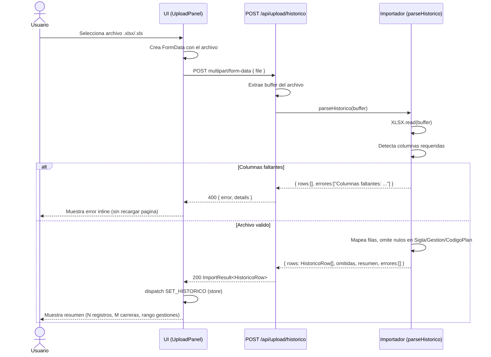
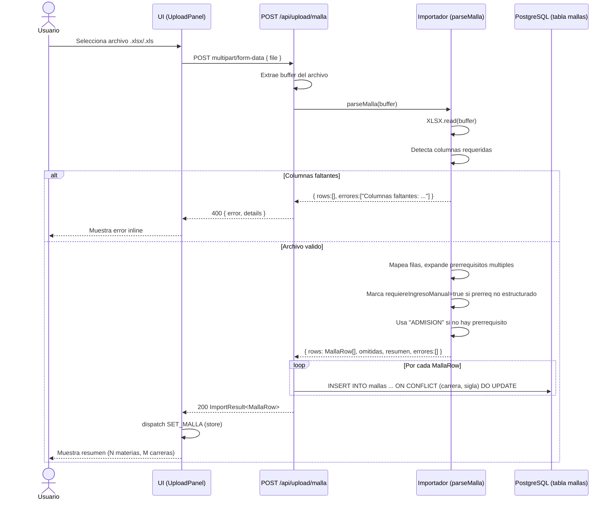
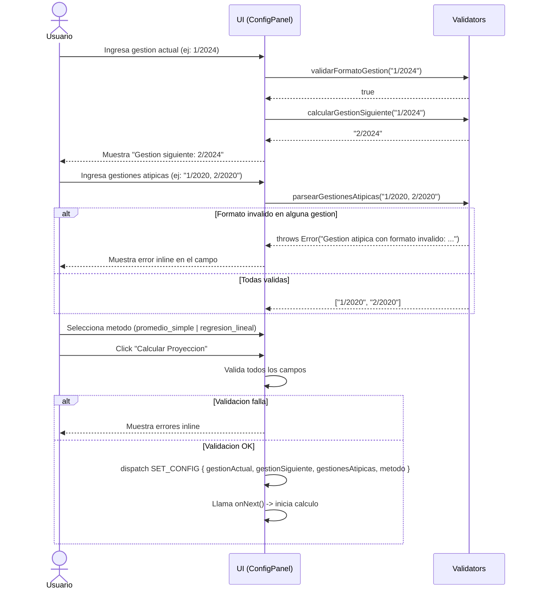
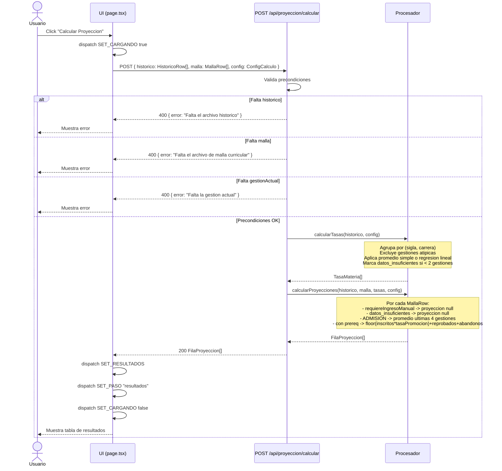
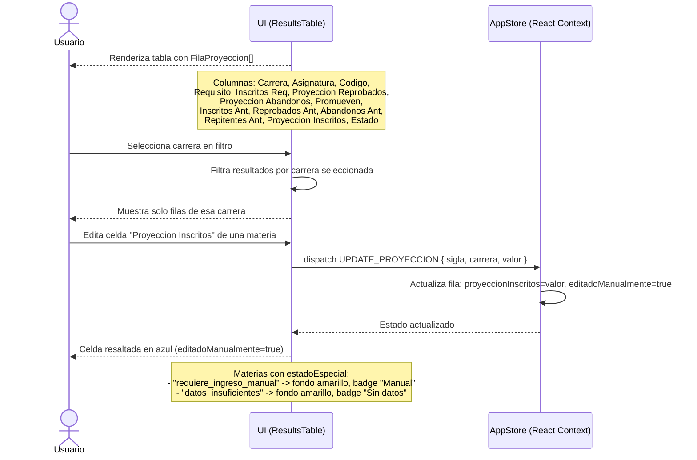
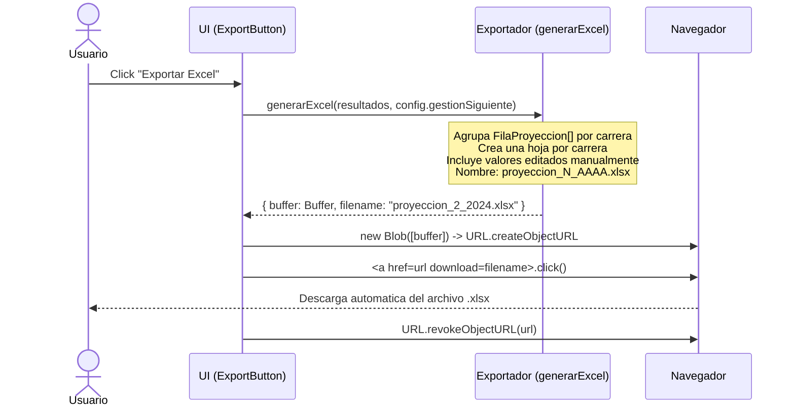
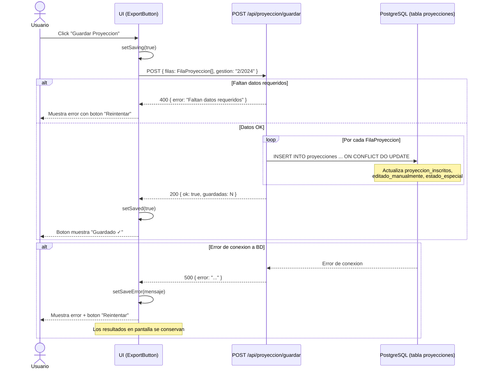
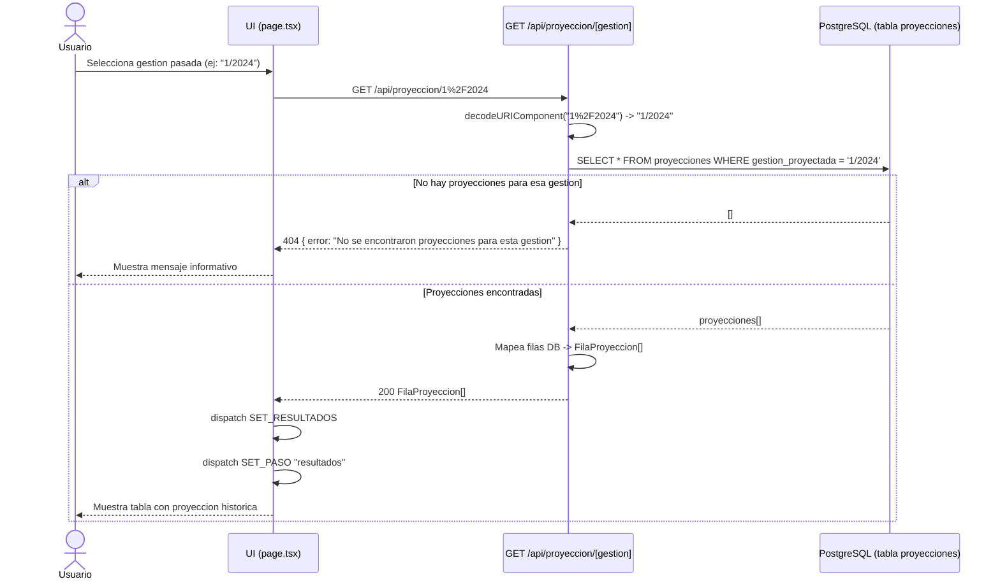
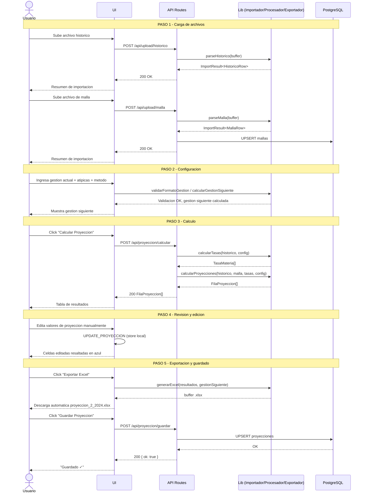

# Diagramas de Secuencia: Estimador de Crecimiento Estudiantil

Los diagramas usan sintaxis Mermaid. Actores participantes:

- **Usuario** — navegador web
- **UI** — componentes React (cliente)
- **API** — Next.js Route Handlers (servidor)
- **Lib** — modulos de logica de negocio (Importador, Procesador, Exportador, Validators)
- **DB** — PostgreSQL en Neon Tech

---

## Secuencia 1: Carga del Archivo Historico

El usuario sube el archivo Excel con el historico de rendimiento academico.



---

## Secuencia 2: Carga del Archivo de Malla Curricular

El usuario sube el archivo Excel con la malla curricular. Los datos se persisten en BD.



---

## Secuencia 3: Configuracion del Calculo

El usuario ingresa la gestion actual, gestiones atipicas y metodo de proyeccion.



---

## Secuencia 4: Calculo de Proyecciones

El sistema calcula tasas estadisticas y proyecciones de inscritos.



---

## Secuencia 5: Visualizacion y Edicion de Resultados

El usuario revisa la tabla de proyecciones y edita valores manualmente.



---

## Secuencia 6: Exportacion a Excel

El usuario exporta los resultados a un archivo .xlsx con descarga automatica.



---

## Secuencia 7: Guardado de Proyeccion en Base de Datos

El usuario guarda la proyeccion para consulta futura.



---

## Secuencia 8: Consulta de Proyeccion Historica

El usuario consulta una proyeccion guardada en una gestion anterior.



---

## Secuencia 9: Descarga de Excel de Proyeccion Historica

El usuario descarga el Excel de una proyeccion ya guardada en BD.

```mermaid
sequenceDiagram
    actor Usuario
    participant UI as UI (ExportButton)
    participant API as GET /api/export/[gestion]
    participant DB as PostgreSQL (tabla proyecciones)
    participant Lib as Exportador (generarExcel)
    participant Browser as Navegador

    Usuario->>UI: Click "Exportar Excel" (proyeccion historica)
    UI->>API: GET /api/export/2%2F2024
    API->>API: decodeURIComponent -> "2/2024"
    API->>DB: SELECT * FROM proyecciones WHERE gestion_proyectada = '2/2024'

    alt No hay datos
        DB-->>API: []
        API-->>UI: 404 { error: "No se encontraron proyecciones" }
        UI-->>Usuario: Muestra error
    else Datos encontrados
        DB-->>API: proyecciones[]
        API->>API: Mapea filas DB -> FilaProyeccion[]
        API->>Lib: generarExcel(filas, "2/2024")
        Lib-->>API: { buffer, filename: "proyeccion_2_2024.xlsx" }
        API-->>Browser: 200 Response(buffer) con headers:
        Note over API: Content-Type: application/vnd.openxmlformats-officedocument.spreadsheetml.sheet
        Note over API: Content-Disposition: attachment; filename="proyeccion_2_2024.xlsx"
        Browser-->>Usuario: Descarga automatica del archivo
    end
```

---

## Secuencia 10: Flujo Completo de Extremo a Extremo

Vision general del flujo principal de uso del sistema.



---

## Resumen de Actores y Responsabilidades

| Actor | Responsabilidad |
|-------|----------------|
| **Usuario** | Sube archivos, configura parametros, revisa/edita resultados, exporta |
| **UI** | Gestiona estado local (AppStore), valida inputs, llama a APIs, renderiza componentes |
| **API Routes** | Valida precondiciones, orquesta llamadas a Lib y DB, retorna errores estructurados |
| **Importador** | Parsea buffers Excel, valida columnas, omite filas invalidas, retorna ImportResult |
| **Procesador** | Calcula tasas estadisticas (promedio/regresion) y proyecciones de inscritos |
| **Exportador** | Genera archivo .xlsx con una hoja por carrera |
| **Validators** | Valida formato de gestion, calcula gestion siguiente, parsea gestiones atipicas |
| **DB** | Persiste mallas curriculares y proyecciones; soporta upsert por clave natural |
